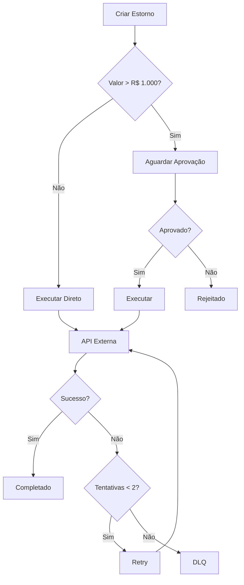
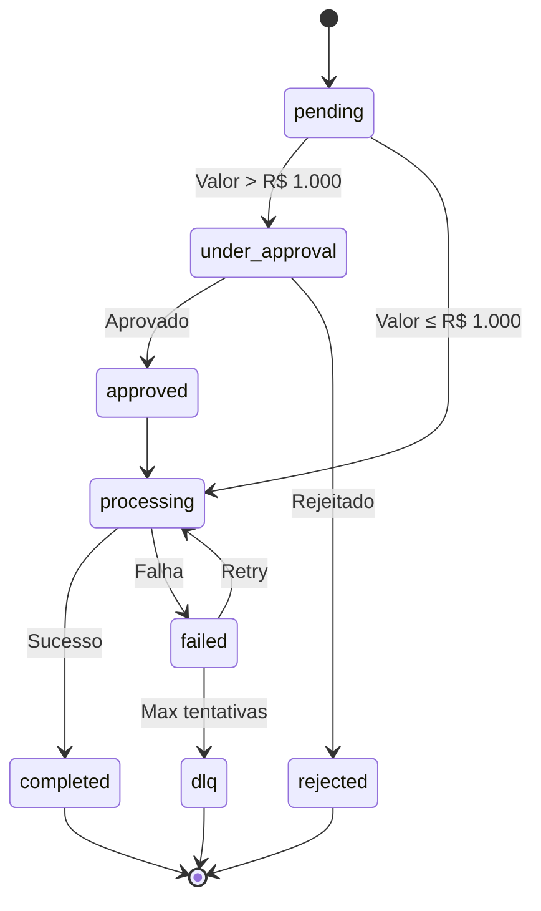

# 📊 Diagrama Simples - Sistema de Aprovação de Estorno

## 🔄 Fluxo Principal

```mermaid
flowchart TD
    A[Criar Estorno] --> B{Valor > R$ 1.000?}
    B -->|Não| C[Executar Direto]
    B -->|Sim| D[Aguardar Aprovação]
    D --> E{Aprovado?}
    E -->|Sim| F[Executar]
    E -->|Não| G[Rejeitado]
    F --> H[API Externa]
    C --> H
    H --> I{Sucesso?}
    I -->|Sim| J[Completado]
    I -->|Não| K{Tentativas < 2?}
    K -->|Sim| L[Retry]
    K -->|Não| M[DLQ]
    L --> H
```

## 📋 Estados do Estorno

```mermaid
stateDiagram-v2
    [*] --> pending
    pending --> under_approval : Valor > R$ 1.000
    pending --> processing : Valor ≤ R$ 1.000
    under_approval --> approved : Aprovado
    under_approval --> rejected : Rejeitado
    approved --> processing
    processing --> completed : Sucesso
    processing --> failed : Falha
    failed --> processing : Retry
    failed --> dlq : Max tentativas
    completed --> [*]
    rejected --> [*]
    dlq --> [*]
```
