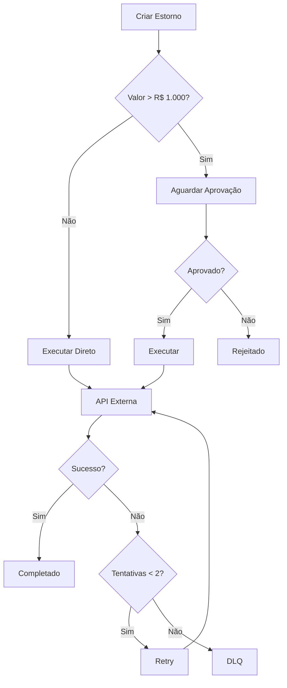
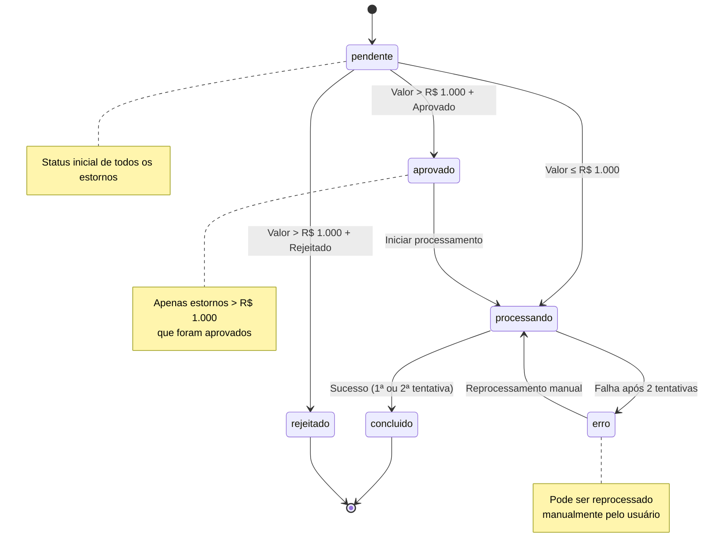

# 📊 Diagrama Simples - Sistema de Aprovação de Estorno

## 🔄 Fluxo Principal

```mermaid
flowchart TD
    A[Criar Estorno] --> B{Valor > R$ 1.000?}
    B -->|Não| C[Executar Direto]
    B -->|Sim| D[Aguardar Aprovação]
    D --> E{Aprovado?}
    E -->|Sim| F[Executar]
    E -->|Não| G[Rejeitado]
    F --> H[API Externa]
    C --> H
    H --> I{Sucesso?}
    I -->|Sim| J[Completado]
    I -->|Não| K{Tentativas < 2?}
    K -->|Sim| L[Retry]
    K -->|Não| M[DLQ]
    L --> H
```

## 📋 Estados do Estorno

```mermaid
stateDiagram-v2
    [*] --> pendente
    pendente --> processando : Valor ≤ R$ 1.000
    pendente --> aprovado : Valor > R$ 1.000 + Aprovado
    pendente --> rejeitado : Valor > R$ 1.000 + Rejeitado
    aprovado --> processando : Iniciar processamento
    processando --> concluido : Sucesso (1ª ou 2ª tentativa)
    processando --> erro : Falha após 2 tentativas
    erro --> processando : Reprocessamento manual
    concluido --> [*]
    rejeitado --> [*]
    
    note right of pendente
        Status inicial de todos os estornos
    end note
    
    note right of aprovado
        Apenas estornos > R$ 1.000
        que foram aprovados
    end note
    
    note right of erro
        Pode ser reprocessado
        manualmente pelo usuário
    end note
```

