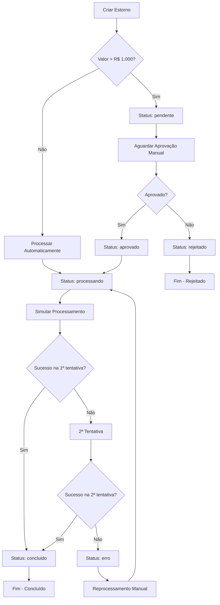
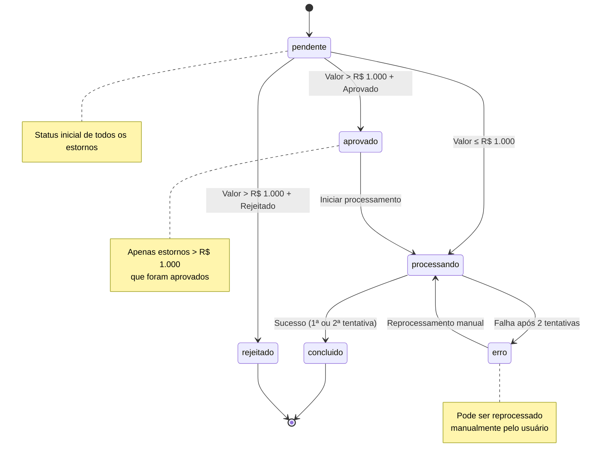

# 📊 Diagrama Simples - Sistema de Aprovação de Estorno

## 🔄 Fluxo Principal

```mermaid
flowchart TD
    A[Criar Estorno] --> B{Valor > R$ 1.000?}
    B -->|Não| C[Processar Automaticamente]
    B -->|Sim| D[Status: pendente]
    D --> E[Aguardar Aprovação Manual]
    E --> F{Aprovado?}
    F -->|Sim| G[Status: aprovado]
    F -->|Não| H[Status: rejeitado]
    G --> I[Status: processando]
    C --> I
    I --> J[Simular Processamento]
    J --> K{Sucesso na 1ª tentativa?}
    K -->|Sim| L[Status: concluido]
    K -->|Não| M[2ª Tentativa]
    M --> N{Sucesso na 2ª tentativa?}
    N -->|Sim| L
    N -->|Não| O[Status: erro]
    O --> P[Reprocessamento Manual]
    P --> I
    H --> Q[Fim - Rejeitado]
    L --> R[Fim - Concluído]
```

## 📋 Estados do Estorno

```mermaid
stateDiagram-v2
    [*] --> pendente
    pendente --> processando : Valor ≤ R$ 1.000
    pendente --> aprovado : Valor > R$ 1.000 + Aprovado
    pendente --> rejeitado : Valor > R$ 1.000 + Rejeitado
    aprovado --> processando : Iniciar processamento
    processando --> concluido : Sucesso (1ª ou 2ª tentativa)
    processando --> erro : Falha após 2 tentativas
    erro --> processando : Reprocessamento manual
    concluido --> [*]
    rejeitado --> [*]
    
    note right of pendente
        Status inicial de todos os estornos
    end note
    
    note right of aprovado
        Apenas estornos > R$ 1.000
        que foram aprovados
    end note
    
    note right of erro
        Pode ser reprocessado
        manualmente pelo usuário
    end note
```

