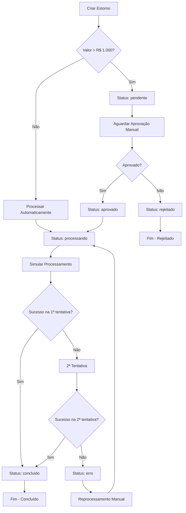
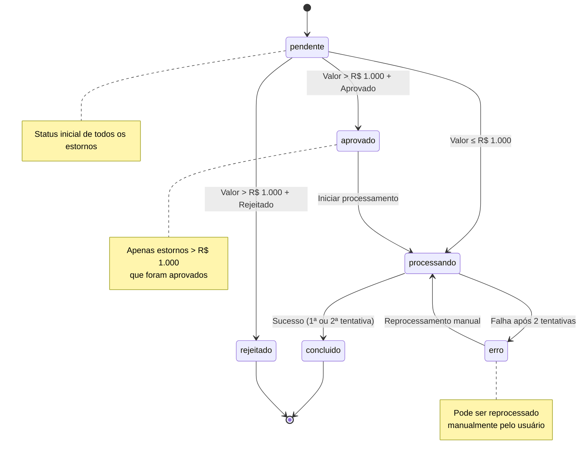
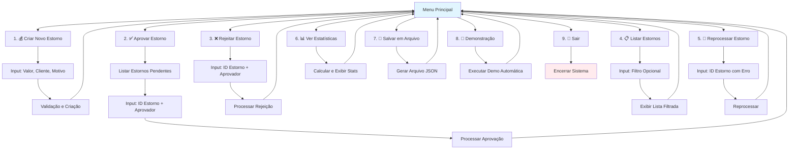
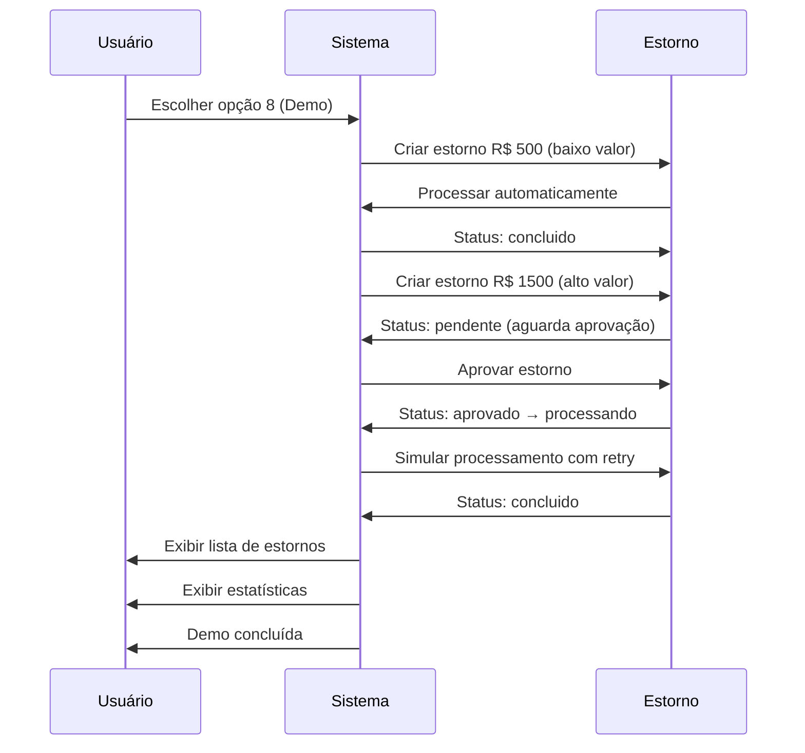

# 📊 Diagramas - Sistema Completo de Gestão de Estornos

Este documento contém os diagramas que representam o fluxo completo do sistema de estornos implementado, incluindo todas as funcionalidades do menu interativo.

## 🔄 Fluxo Principal de Processamento

## 📋 Estados do Estorno

## 🎛️ Menu Interativo - Estrutura de Navegação

## 🔄 Fluxo de Demonstração Automática

