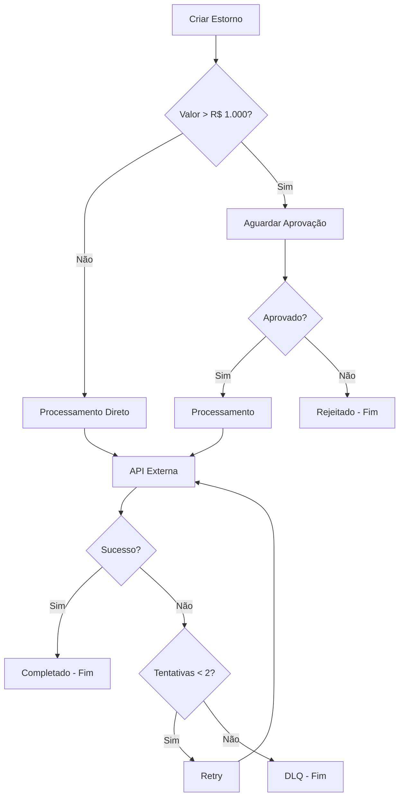

# 🤖 Projetos de Automação de Reembolso - Análise Completa

> Aqui esta a minha análise detalhada de três abordagens diferentes para automação de processos de reembolso: Agente Conversacional (A1), Sistema Multiagentes (A2) e Workflow Determinístico (A3).

## 📋 Índice

- [A1 - Agente Conversacional](#-a1---agente-conversacional)
- [A2 - Sistema Multiagentes](#-a2---sistema-multiagentes)
- [A3 - Workflow Determinístico](#-a3---workflow-determinístico)
- [Análise Comparativa](#-análise-comparativa)
- [Decisões Técnicas](#-decisões-técnicas)
- [Lições Aprendidas](#-lições-aprendidas)

## 🧠 A1 - Agente Conversacional

### **Diferenciação: Agente vs Workflow vs Assistente**

**Por que um Agente?**

- **Memória contextual**: Lembra conversas anteriores (diferente de assistente stateless)
- **Ferramentas especializadas**: Calcula reembolsos automaticamente
- **RAG integrado**: Acessa política de reembolso via embeddings
- **Autonomia**: Decide quando usar ferramentas vs. responder diretamente

### **Estrutura do Agente**

```
┌─────────────────────────────────────────────────────────────┐
│                    ESTRUTURA DO AGENTE A1                   │
└─────────────────────────────────────────────────────────────┘

┌─────────────────┐    ┌─────────────────┐    ┌─────────────────┐
│   ENVIRONMENT   │    │     MEMORY      │    │    TOOLS        │
│                 │    │                 │    │                 │
│ • SQLite DB     │    │ • Curto Prazo   │    │ • compute_refund│
│ • LanceDB       │    │   	   	         │    │   (Cálculo)     │
│ • PDF Knowledge │    │ • Sessão        │    │ • RAG Search    │
│ • Azure OpenAI  │    │   	             │    │   (Knowledge)   │
└─────────────────┘    └─────────────────┘    └─────────────────┘
         │                       │                       │
         └───────────────────────┼───────────────────────┘
                                 │
                    ┌─────────────────┐
                    │   AGENT CORE    │
                    │                 │
                    │ • Instructions  │
                    │ • Decision      │
                    │ • Context       │
                    │ • State Mgmt    │
                    └─────────────────┘
                                 │
                    ┌─────────────────┐
                    │   INTERFACE     │
                    │                 │
                    │ • CLI (main)    │
                    │ • Streamlit     │
                    │ • User Input    │
                    └─────────────────┘
```

### **Sistema de Memória**

**Por que essa escolha:**

- **Memória de Curto Prazo**: Eficiência (limita tokens), relevância (contexto recente)
- **Memória de Sessão**: Auditoria, persistência, exportação

### **Ferramenta de Cálculo**

**Calcula reembolso:**

```python
@tool(stop_after_tool_call=False)
def compute_refund(valor: float):
    """
    Calcula o reembolso considerando imposto e teto máximo, recebe um valor e retorna o resultado do cálculo.
    """
    percentual_imposto: float = 15.0
    teto: float = 1000.0

    imposto = valor * (percentual_imposto / 100)
    valor_final = valor - imposto
    precisa_aprovacao = valor_final > teto

    resultado = f"""
💰 Cálculo de Reembolso

    Valor original: R$ {valor}
    Imposto (15%): R$ {imposto}
    Valor final do reembolso: R$ {valor_final}
    """
    if precisa_aprovacao:
        resultado += f"\n⚠️ ATENÇÃO: Valor acima de R$ {teto} - Precisa aprovação do Financeiro!"
    else:
        resultado += f"\n✅ Reembolso aprovado automaticamente (abaixo de R$ {teto})."
    return resultado
```

**Quando acionada:**

- Detecta solicitação de cálculo: "Calcule o reembolso de R$ 500"
- Identifica valores monetários: "Quanto fica R$ 1.250,00?"
- Contexto de reembolso com valores específicos

---

## 🤝 A2 - Sistema Multiagentes

### **Quando Multiagentes Supera Agente Único**

**Vantagens:**

1. **Especialização**: Cada agente foca em uma competência específica
2. **Qualidade**: Múltiplas perspectivas melhoram o resultado final
3. **Escalabilidade**: Pode processar tarefas complexas em paralelo
4. **Robustez**: Falha de um agente não compromete todo o sistema

### **Estratégia de Coordenação**

**Pipeline Sequencial:**

```python
def executar_sistema_multiagentes():
    # 1. Redator escreve
    resposta_redator = redator.run(solicitacao_inicial)
  
    # 2. Crítico analisa
    resposta_critico = critico.run(texto_do_redator)
  
    # 3. Editor finaliza
    resposta_editor = editor.run(texto_inicial + criticas)
```

**Especialização dos Agentes:**

```python
redator = Agent(
    name="Redator",
    role="Especialista em redação de comunicados claros para clientes",
    instructions="Escrever comunicado CLARO sobre política de reembolsos..."
)

critico = Agent(
    name="Crítico", 
    role="Analista de qualidade que identifica inconsistências e problemas",
    instructions="Verificar CLAREZA, COMPLETUDE, AMBIGUIDADES..."
)

editor = Agent(
    name="Editor",
    role="Editor-chefe que produz a versão final do comunicado",
    instructions="Produzir versão FINAL corrigindo todos os problemas..."
)
```

### **Gerenciamento de State Compartilhado**

**Abordagem: Passagem de Dados Sequencial**

```python
# State é passado como parâmetros entre agentes:
def executar_sistema_multiagentes():
    # State inicial
    solicitacao_inicial = "Escreva um comunicado..."
  
    # State após Redator
    resposta_redator = redator.run(solicitacao_inicial)
    texto_inicial = resposta_redator.content
  
    # State após Crítico  
    solicitacao_critica = f"Analise este comunicado: {texto_inicial}"
    resposta_critico = critico.run(solicitacao_critica)
    analise_critica = resposta_critico.content
  
    # State final
    solicitacao_final = f"""
    TEXTO ORIGINAL: {texto_inicial}
    ANÁLISE: {analise_critica}
    """
    resposta_editor = editor.run(solicitacao_final)
```

**Sem conflitos de edição** porque:

- Execução sequencial (apenas um agente por vez)
- State local (cada agente trabalha com sua cópia)
- Sem concorrência

### **Falhas e Guardrails**

**Falhas Identificadas:**

1. **Loops Infinitos**: Crítico pode continuar encontrando problemas
2. **Eco Chamber**: Agentes podem reforçar preconceitos
3. **Degradação de Qualidade**: Múltiplas iterações podem piorar resultado

**Guardrails Implementados:**

```python
# 1. Limitação de rodadas
# "Máximo de 2 rodadas para evitar loops infinitos."

# 2. Critérios de parada
instructions=dedent("""
    Se estiver tudo OK, diga: "✅ Aprovado sem ressalvas"
""")

# 3. Formato estruturado
instructions=dedent("""
    Use formato: "❌ Problema: [descrição] | 📍 Fonte: [trecho exato]"
""")
```

---

## ⚙️ A3 - Workflow Determinístico

### **Definição de Workflow e Justificativa do DAG**

A primeira coisa que me veio à cabeça foi pensar na entrada e saída da informação — e foi a partir disso que comecei a construir o raciocínio. Quando a gente fala de  **workflow** , estamos falando de uma sequência de tarefas bem organizadas, que seguem uma lógica definida pra realizar uma ação específica. No nosso caso, essa ação é o estorno.

É como se o sistema seguisse um roteiro: cada etapa depende da anterior e prepara o terreno pra próxima. Isso garante que tudo aconteça de forma estruturada, sem atropelos, e com rastreabilidade. No fim das contas, esse tipo de fluxo ajuda a manter o processo mais claro, confiável e fácil de dar manutenção

**Justificativa do DAG (Directed Acyclic Graph):**

- **Direcionado**: Cada etapa tem direção clara (criação → aprovação → processamento → conclusão)
- **Acíclico**: Não há loops infinitos - fluxo sempre progride para estado final
- **Grafo**: Múltiplas rotas possíveis baseadas em condições

**Fluxo do Workflow:**



### **Variáveis de Decisão e Rotas Alternativas**

**Variáveis de Decisão:**

1. **Valor do estorno** (`amount`):

   - `≤ R$ 1.000`: Processamento direto
   - `> R$ 1.000`: Requer aprovação
2. **Status de aprovação**:

   - `approved`: Prossegue para processamento
   - `rejected`: Finaliza o workflow
3. **Resultado do processamento**:

   - Sucesso: Workflow completo
   - Falha: Retry ou DLQ

### **Tratamento de Erros**

**Retry/Backoff:**

Dentro da função `processar_estorno()`, coloquei uma lógica de tentativa e erro. A ideia é tentar fazer o estorno duas vezes, no máximo. Na primeira tentativa, ele já simula uma falha — como se fosse um erro temporário. Só pra testar como o sistema reage.

Aí, antes de cada tentativa, ele espera um pouco: 0,3 segundos na primeira, 0,6 na segunda. Isso é um tipo de ‘respiro’, como se o sistema estivesse tomando fôlego antes de tentar de novo. Essa pausa ajuda a evitar que o erro se repita logo em seguida, especialmente se for algo temporário, tipo uma instabilidade momentânea.

Se der certo na segunda tentativa, ele marca o estorno como ‘completed’ e segue a vida. Mas se der erro, ele registra o que aconteceu e mostra no console qual tentativa falhou.

No fim das contas, é uma forma de deixar o processo mais robusto, lidando com falhas que podem acontecer de vez em quando.

**Trecho do código:**

```python
# Implementado na função processar_estorno()
for tentativa in range(1, 3):  # Máximo 2 tentativas
    try:
        e["retry_count"] = tentativa
        time.sleep(0.3 * tentativa)  # Backoff linear: 0.3s, 0.6s
        # Simulação de falha na primeira tentativa
        if tentativa < 2:
            raise Exception("Erro temporário")
        # Sucesso na segunda tentativa
        e["status"] = "completed"
        return
    except Exception as exc:
        e["error"] = str(exc)
        print(f"[ERRO] Tentativa {tentativa} falhou: {exc}")
```

**Compensações:**

- **DLQ (Dead Letter Queue)**: Estornos que falharam após todas as tentativas
- **Reprocessamento**: Função `reprocessar_dlq()` permite reprocessar itens da DLQ
- **Estado persistente**: Todos os estados mantidos em memória para auditoria

**Idempotência:**

Já para a Idepotencia a função `criar_estorno` foi feita pra ser esperta. Antes de sair criando um novo estorno, ela dá uma olhada se aquele `request_id` já foi usado. Se já tiver um estorno com esse ID, ela simplesmente devolve o que já existe sobre ele e pronto — sem duplicar nada.

Isso é ótimo porque evita bagunça. Imagina que, por algum motivo, a mesma requisição foi enviada duas vezes — pode ter sido um erro, um timeout, ou o sistema tentando de novo (retry). Com essa verificação, a função garante que o estorno não vai ser feito duas vezes.

No fim das contas, é uma forma de manter tudo seguro e consistente, mesmo quando as coisas saem do controle.

**Trecho do código:**

```python
def criar_estorno(request_id, amount, customer_id, reason=""):
    if request_id in estornos:
        print("[IDEMPOTENCIA] Estorno já existe, retornando existente.")
        return estornos[request_id]  # Retorna o existente sem duplicar
```

**Estratégias de Recuperação:**

1. **Retry automático**: Até 2 tentativas com backoff
2. **DLQ**: Isolamento de falhas persistentes
3. **Reprocessamento manual**: Intervenção humana para casos críticos
4. **Exportação**: Backup dos dados para análise externa

## 📊 Perguntas gerais sobre o conjunto A.

### **Modelagem do Problema**

**Hipóteses Iniciais:**

| Projeto      | Hipóteses Principais                                                                                                                                                                                  |
| ------------ | ------------------------------------------------------------------------------------------------------------------------------------------------------------------------------------------------------ |
| **A1** | H1: Interface conversacional preferida;<br />H2: RAG mais eficaz que regras;<br />H3: Memória contextual melhora UX;<br />H4: Cálculos automáticos reduzem erros.                                   |
| **A2** | <br />H1: Divisão de responsabilidades melhora qualidade;<br />H2: Crítico rigoroso reduz ambiguidades;<br />H3: Pipeline sequencial mais controlável;<br />H4: Máximo 2 rodadas suficiente.       |
| **A3** | H1: Processo determinístico mais confiável;<br />H2: Retry automático reduz falhas;<br />H3: DLQ necessária para casos persistentes;<br />H4: Idempotência crítica para operações financeiras. |

**Riscos e Mitigações:**

| Projeto | Risco                         | Mitigação Implementada                        |
| ------- | ----------------------------- | ----------------------------------------------- |
| A1      | **Alucinação** do LLM | RAG + instruções restritivas                  |
| A1      | **Custo** de tokens     | Buffer limitado + temperatura baixa             |
| A2      | **Loops infinitos**     | Limite de rodadas + critérios de parada        |
| A2      | **Eco chamber**         | Instruções específicas + formato estruturado |
| A3      | **Perda de dados**      | Estado persistente + exportação JSON          |
| A3      | **Falhas em cascata**   | Retry + DLQ + reprocessamento                   |

**Métricas de Sucesso:**

| Projeto      | Métricas Alcançadas                                                                                                                                                 |
| ------------ | --------------------------------------------------------------------------------------------------------------------------------------------------------------------- |
| **A1** | ✅ Precisão (RAG)<br />✅ Contexto (memória funcional)<br />✅ Automação (cálculos)<br />✅ Usabilidade (CLI + Web)                                              |
| **A2** | ✅ Qualidade (crítico identifica problemas)<br />✅ Estrutura (formato padronizado)<br />✅ Controle (máximo 2 rodadas)<br />✅ Completude (DoD atendido)           |
| **A3** | ✅ Confiabilidade (retry + DLQ)<br />✅ Idempotência (duplicatas detectadas)<br />✅ Rastreabilidade (estados definidos)<br />✅ Recuperação (reprocessamento DLQ) |

### **Evolução dos Prompts**

**A1 - Agente de Reembolso:**

**VERSÃO 1 (Inicial):**

```python
instructions = """
Você é um assistente de políticas de reembolso.
- Responda perguntas sobre reembolso
- Use a ferramenta compute_refund quando necessário
- Seja educado e claro
"""
```

**VERSÃO 2 (Final):**

```python
instructions = """
Você é um assistente de políticas de reembolso.
Regras:
- Responda SOMENTE com base nos trechos recuperados da base de conhecimento kb (RAG).
- Cite o trecho/assunto quando possível.
- Se precisar calcular, use a ferramenta compute_refund.
- Se a resposta não estiver na política, diga que não encontrou.
- Seja claro, educado e use emojis quando fizer sentido.
"""
```

**A2 - Multiagentes:**

**VERSÃO 1 (Crítico - Inicial):**

```python
instructions = """
Você é um crítico de comunicados.
- Verifique clareza e completude
- Identifique problemas
- Seja construtivo
"""
```

**VERSÃO 2 (Crítico - Final):**

```python
instructions = """
Você é um crítico rigoroso de comunicados.

Sua missão:
- Verificar CLAREZA: O texto é fácil de entender?
- Verificar COMPLETUDE: Faltam informações importantes?
- Verificar AMBIGUIDADES: Algo pode ser mal interpretado?

IMPORTANTE:
- SEMPRE cite a FONTE dos problemas (qual frase/parágrafo)
- Use formato: "❌ Problema: [descrição] | 📍 Fonte: [trecho exato]"
- Se estiver tudo OK, diga: "✅ Aprovado sem ressalvas"

Seja específico e construtivo!
"""
```

---

## 🛠️ Decisões Técnicas

### **Bibliotecas/Padrões Python**

**A1 - Agente de Reembolso:**

**ADOTADOS:**

```python
# Framework de Agentes
from agno.agent import Agent
from agno.tools import tool
from agno.models.azure.openai_chat import AzureOpenAI

# RAG e Knowledge Base
from agno.knowledge.embedder.azure_openai import AzureOpenAIEmbedder
from agno.knowledge.reader.pdf_reader import PDFReader
from agno.knowledge.knowledge import Knowledge
from agno.vectordb.lancedb import LanceDb

# Persistência
from agno.db.sqlite.sqlite import SqliteDb

# Interface
import streamlit as st

# Utilitários
from dotenv import load_dotenv
import asyncio
import json
```

**DESCARTADOS:**

| Biblioteca          | Motivo do Descarte                                         |
| ------------------- | ---------------------------------------------------------- |
| **Langchain** | Agno oferece abstração mais simples e integrada          |
| **ChromaDB**  | LanceDB tem melhor performance e menor overhead            |
| **FastAPI**   | Streamlit é mais adequado para prototipagem rápida       |
| **Redis**     | SQLite é suficiente para persistência local              |
| **Celery**    | Não há necessidade de processamento assíncrono complexo |

**A2 - Multiagentes:**

**ADOTADOS:**

```python
# Framework de Agentes
from agno.agent import Agent
from agno.models.azure.openai_chat import AzureOpenAI

# Utilitários
from textwrap import dedent
from dotenv import load_dotenv
```

**DESCARTADOS:**

- **Orquestradores complexos** (Prefect, Airflow): Pipeline simples não justifica
- **Message queues** (RabbitMQ, Kafka): Comunicação direta é suficiente
- **State management** (Redis, Memcached): Passagem de parâmetros funciona

**A3 - Workflow:**

**ADOTADOS:**

```python
# Bibliotecas padrão apenas
import json
import time
import uuid
from datetime import datetime
```

**DESCARTADOS:**

- **Workflow engines** (Temporal, Prefect): Overhead desnecessário para caso simples
- **Message brokers**: Processamento síncrono é adequado
- **ORM** (SQLAlchemy): Dicionário em memória é suficiente para demo

### **Padrões de Código Adotados**

**1. Dependency Injection:**

```python
# A1 - Injeção de dependências
def processar_pergunta(agente, pergunta: str, memoria: MemoriaAgente = None):
    # Agente e memória injetados como parâmetros
```

**2. Factory Pattern:**

```python
# A1 - Factory para criação de agentes
def criar_agente():
    # Centraliza configuração complexa
    return Agent(model=chat_model, knowledge=kb, tools=[compute_refund])
```

**3. Strategy Pattern:**

```python
# A3 - Diferentes estratégias de processamento
if amount <= 1000:
    processar_estorno(request_id)  # Estratégia automática
else:
    print("[APROVACAO] Valor > R$ 1000, precisa de aprovação")  # Estratégia manual
```

**4. Observer Pattern:**

```python
# A1 - Sistema de memória observa interações
def adicionar_mensagem(self, papel: str, conteudo: str):
    # Notifica mudanças de estado
```

### **Justificativas Técnicas**

**AGNO Framework:**

- ✅ **Abstração simplificada**: Menos boilerplate que LangChain
- ✅ **Integração nativa**: RAG, tools e models em uma API
- ✅ **Azure OpenAI**: Suporte nativo para ambiente corporativo
- ✅ **Performance**: Otimizado para casos de uso específicos

**LanceDB:**

- ✅ **Performance**: Mais rápido que ChromaDB para embeddings
- ✅ **Simplicidade**: Menos configuração que Pinecone/Weaviate
- ✅ **Local**: Não requer serviços externos
- ✅ **Integração**: Funciona bem com Agno

**Streamlit:**

- ✅ **Rapidez**: Prototipagem em minutos
- ✅ **Interatividade**: Chat interface nativa
- ✅ **Estado**: Session state para memória
- ✅ **Deploy**: Fácil deployment em cloud

**Bibliotecas Padrão (A3):**

- ✅ **Simplicidade**: Sem dependências externas
- ✅ **Confiabilidade**: Bibliotecas estáveis e testadas
- ✅ **Performance**: Sem overhead de frameworks
- ✅ **Portabilidade**: Funciona em qualquer ambiente Python

### **Comparação de Abordagens**

| Aspecto                    | A1 (Agno + RAG) | A2 (Agno Multi) | A3 (Pure Python) |
| -------------------------- | --------------- | --------------- | ---------------- |
| **Complexidade**     | Média          | Alta            | Baixa            |
| **Dependências**    | Muitas          | Poucas          | Nenhuma          |
| **Performance**      | Boa             | Boa             | Excelente        |
| **Manutenibilidade** | Boa             | Média          | Excelente        |
| **Escalabilidade**   | Alta            | Alta            | Limitada         |
| **Custo**            | Médio          | Médio          | Baixo            |

---

## 🎓 Lições Aprendidas

### **Princípios Orientadores**

1. **Simplicidade**: Escolher a solução mais simples que resolve o problema
2. **Especialização**: Cada abordagem otimizada para seu caso de uso específico
3. **Confiabilidade**: Tratamento robusto de erros e recuperação
4. **Manutenibilidade**: Código limpo e bem documentado

### **Decisões Arquiteturais-Chave**

1. **A1**: Agno + RAG para conversação contextual com memória
2. **A2**: Pipeline sequencial de agentes especializados
3. **A3**: Workflow determinístico com bibliotecas padrão

### **Insights Importantes**

1. **Escolha por contexto**: Framework complexo nem sempre é melhor
2. **Simplicidade primeiro**: Começar simples e evoluir conforme necessário
3. **Dependências mínimas**: Menos dependências = menos pontos de falha
4. **Performance vs. Features**: Balancear funcionalidades com performance

### **Métricas de Sucesso Alcançadas**

✅ **A1**: Memória funcional, RAG integrado, cálculos automáticos
✅ **A2**: Qualidade de saída, controle de loops, DoD atendido
✅ **A3**: Retry/backoff, DLQ, idempotência, rastreabilidade

### **Conclusão**

Cada projeto demonstra uma abordagem diferente para problemas distintos, mostrando que **não há solução única**, mas sim **soluções adequadas para cada contexto específico**.

A escolha entre Agente, Multiagentes ou Workflow deve ser baseada em:

- **Natureza do problema** (conversacional vs. processual vs. criativo)
- **Requisitos de qualidade** (precisão vs. velocidade vs. confiabilidade)
- **Complexidade do domínio** (regras simples vs. múltiplas competências)
- **Recursos disponíveis** (tempo, orçamento, expertise)

---

## 📁 Estrutura do Projeto

```
Desafios GenAI - Vinicius Berto Quintino/
├── A1/                          # Agente Conversacional
│   ├── agente_reembolso.py      # Agente principal com memória
│   ├── memoria.py               # Sistema de memória
│   ├── app.py                   # Interface Streamlit
│   ├── politica_reembolso_v1.0.pdf
│   ├── politica_reembolso_v1.0.txt
│   ├── requirements.txt
│   └── README.md
├── A2/                          # Sistema Multiagentes
│   ├── multiagente.py           # Sistema de 3 agentes
│   ├── Exemplo - ponto de partida.py
│   ├── requirements.txt
│   └── README.md
├── A3/                          # Workflow Determinístico
│   ├── estorno.py               # Workflow de estorno
│   ├── DIAGRAMAS.md             # Diagramas do fluxo
│   ├── Esboço Inicial.png
│   ├── requirements.txt
│   └── README.md
└── Perguntas Específicas e Gerais.md     # Este arquivo
```

---

**Desenvolvido com bastante dedicação, algumas madrugadas viradas e muito café (risos). Foram exploradas diferentes abordagens de IA para mostrar que não existe uma solução única — tudo depende do contexto específico de cada problema.**
